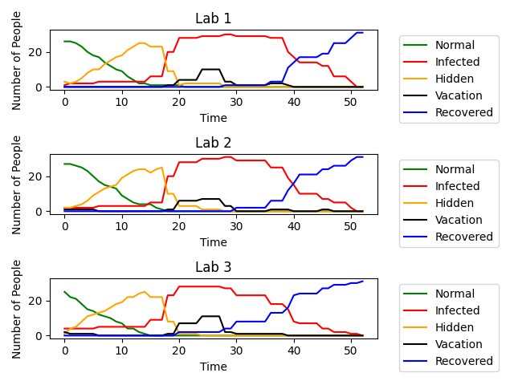
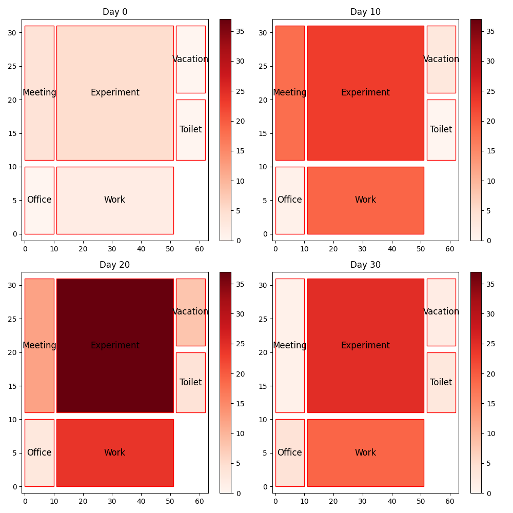

# Modelling infectious disease transmission using an agent-based model

**[ 贡献 ]** 该基于 Agent 的模拟传染病传播模型全过程解耦，易于拓展，参数程度化几乎 100%，旨在提供一个较完善的模拟平台以便于研究不同传染病毒特性、不同实验室规模、不同人员移动策略、不同人员体质/性格、不同聚集行为频率等等影响因素对传染病传播的影响。

****

## 使用

1. clone项目到本地
```bash
git clone https://github.com/CalciumArgon/Infection-Model.git
cd Infection-Model
```
2. 超参数设置
所有允许的超参数均列在 `./config.py` 中包含且赋予了默认值，你可以通过使用**完全相同的命名和级别**在一个新建 `yaml` 文件中设置你的实验参数，该 `yaml` 配置文件可以存放在任意路径

3. 运行指定参数实验
如果不携带 `-cfg` 配置文件，则使用 `./config.py` 中的默认参数；否则用指定的配置文件中的参数覆盖默认参数（只覆盖列在 `yaml` 里的，其余仍默认）
```bash
python main.py
python main.py -cfg ./experiments/test.yaml
```


## 模型设定


**传染与被传染行为**
1. 仅当 `Infected` 状态仅可以传染给 `Normal`。这里所说的“传染”指代的是 `exposure_time` 的增加。更具体地：E区和W区有范围坐标，在传染范围内的时候才会增加对方的暴露时间；其他M区 T区 O区均认为只有单个位置，只要在同一区域便相互增加暴露时间
2. 上述传染过程，就是增加 `exposure_time`，只能使 `Normal` 变成 `Hidden`。且进入潜伏期后不再接受传染，`exposure_time` 从此置 `-1` 表示曾经历过 `Hidden` ？
3. 上述 `Normal --> Hidden` 的过程是一个随机事件，概率随着暴露时间的增加而增加，`p = probability(exposure_time)`。具体函数关系可被设定（可选范围有：XXX），默认为 Logistics
4. `Hidden` 状态的人在 `hidden2infect_day` 后自动变为 `Infected`，具体时间随不同人体质不同而随机，但总的范围可被设定，老师和学生的默认设定为 3~7 天（注意：代码中所有的范围设定，在实际初始化的时候都会随机产生结果并固定该结果）
5. `Infected` 状态下的学生每天有 0.3 概率变成休假 `vacation` 状态，而老师则必然在 `Infeced` 第一天变成 `vacation` 状态。处于该状态的人不会参与接下来的模拟流程，但恢复效果持续
6. `vacation` 状态持续 `vacation2return_day` 后回归模拟，若返回时 `infect2recover_day > 0` 则回归后仍处于 `Infected` 状态，否则回归后变为 `Recovered` 状态
7. `Recovered` 状态的人不再参与任何传染过程、不会再发生任何状态转移，因此全局模拟的终止设定为：所有人都处于 `Recovered` 状态
8. 【额外的传染/免疫】考虑到不同人的体质差异，有些人可能由于外向健谈而导致额外的病毒传播，有些人可能由于免疫系统强大而抵消了部分暴露时间的影响，因此我们设定了 `talktive_capacity` 和 `immune` 来表征这两种情形。同样地，两个参数以及各自产生的人群的概率可在 `yaml` 文件中设定

**移动行为**
1. 整栋楼层分为五个区域：`E` experimental area，`W` working area，`T` toilet，`O` office，`M` meeting area
2. 其中 `E` `W` 为多点区域，`E` 含有连续坐标格点，人员可以在其中随机移动，只有当二者距离小于传播半径时才会传播暴露时间；`W` 含有离散坐标格点，代表不同工位，由于我们为所有 Agent 设置了全局唯一的标识编号，我们认为相邻一个座位为 1 个传染半径单位；`T` `O` `M` 为单点区域（只要在区域中就认为小于传播半径）
3. 学生和老师有各自的区域转移矩阵 `move_matrix`，即从每个区域转移到另一个区域的概率分布，该矩阵基于经验设定，可以在 `yaml` 文件中设定符合你实际情况的移动策略


## 数据监测

**关于为什么要区分不同实验室的Agent**

在同一次模拟中，不同的实验室学生可以采取不同的行为策略，比如更大的开会聚集规模，更长的开会聚集时间，更高的开会聚集频率等，更重要的是他们在非开会时间混合在一起，可以控制单独的传染因素变量

1. 对于每名学生/老师，我们在 `history` 中记录了：
    * 行动轨迹
    * 被其他人依次传染了多少暴露时间
    * 在每个区域中增加了多少暴露时间
    * 变成 `Hidden` 和 `Infected` 的区域
    * 他在每个区域传染别人的贡献量
2. 基于对所有 Agent 的历史记录，我们得以在 Simulation 全局中追踪所有关于传染人数、位置的历史信息，例如：
    * 每个实验室随天数的各状态人数变化
    * 各个区域的 `Infected` 人数比例


