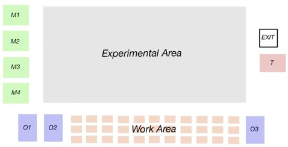

# Modelling infectious disease transmission using an agent-based model

## 使用

1. clone项目到本地
```bash
git clone https://github.com/CalciumArgon/Infection-Model.git
cd Infection-Model
```
2. 超参数设置
所有允许的超参数均列在 `./config.py` 中包含且赋予了默认值，你可以通过使用**完全相同的命名和级别**在一个新建 `yaml` 文件中设置你的实验参数，该 `yaml` 配置文件可以存放在任意路径

3. 运行指定参数实验
如果不携带 `-cfg` 配置文件，则使用 `./config.py` 中的默认参数；否则用指定的配置文件中的参数覆盖默认参数（只覆盖列在 `yaml` 里的，其余仍默认）
```bash
python main.py
python main.py -cfg ./experiments/test.yaml
```

## 模型设定



### 传染与被传染
1. 仅当 `Infected` 状态仅可以传染给 `Normal`。这里所说的“传染”指代的是 `exposure_time` 的增加。更具体地：E区和W区有范围坐标，在传染范围内的时候才会增加对方的暴露时间；其他M区 T区 O区均认为只有单个位置，只要在同一区域便相互增加暴露时间
2. 上述传染过程，就是增加 `exposure_time`，只能使 `Normal` 变成 `Hidden`。且进入潜伏期后不再接受传染，`exposure_time` 从此置 `-1` 表示曾经历过 `Hidden` ？
3. 上述 `Normal --> Hidden` 的过程是一个随机事件，概率随着暴露时间的增加而增加，`p = probability(exposure_time)`。具体函数关系可被设定（可选范围有：XXX），默认为 Logistics
4. `Hidden` 状态的人在 `hidden2infect_day` 后自动变为 `Infected`，具体时间随不同人体质不同而随机，但总的范围可被设定，老师和学生都默认 3~7 天

### TODO
1. `Student.state_duration` 是记录当前状态的持续时间吗? 是做什么的